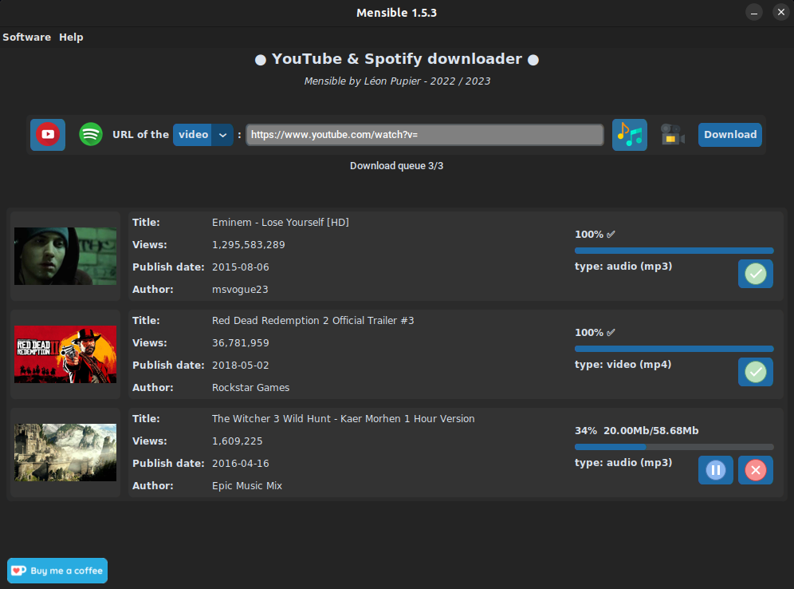

<div align="center">
  <a href="https://github.com/LeonPupier/Mensible">
    
  </a>
  <h3 align="center">Mensible</h3>
  
  A software to download videos and music for free !
  
  <a href="https://www.leonpupier.fr/projects/mensible"><strong>See on the website »</strong></a>
  
  [](https://github.com/LeonPupier/Mensible/releases)
  [](http://hits.dwyl.com/LeonPupier/Mensible)
  
  [](https://github.com/LeonPupier/Mensible/)
  [](https://github.com/LeonPupier/Mensible/)
</div>

---

### Description
Mensible is a completely free software financed only by donations from generous
users in order to offer you the possibility to download videos and music hosted
on YouTube and Spotify for free. All you have to do is enter the URL of the video
and you're done! The interface is simple and pleasant. You can download the music
one by one or provide the link of a playlist and everything will be downloaded at
the same time, convenient no? You can also customize the application via the settings.

### Requirements
In order to use the software on your computer, it must meet several requirements:
- **Operating system:**
Linux, Windows *(In progress...)*
- **Processor architecture:**
64 bits recommended
- **Informations:**
Internet access required and administrator rights are optional

### Installation

> [!IMPORTANT]
> *The software currently works with Python version 3.11.x*

**1.** To install Mensible on your computer, you need to download the latest [release](https://github.com/LeonPupier/Mensible/releases/latest).

**2.** Before you can launch the software, you must install its dependencies.
Nothing could be simpler, just run this command at the root of the folder:

> [!NOTE]
> *Please note that depending on the configuration, the "python3" command may be replaced by "python" or even "py".*

```
python3 -m pip install -r requirements.txt
```
**3.** You can now run the main file of the program with Python:
```
python3 main.py
```
You are now ready to use Mensible!

> [!WARNING]
> *Download the releases and do not clone the repo. It is a working tool in perpetual improvement. You expose yourself to bugs and instability (Except if you want to hunt bugs).*

### How does Spotify support work?

Spotify protects its music with DRM (Digital Rights Management), which means that no one can download the raw audio stream.
To do this, Mensible retrieves the music informations and searches in YouTube for the most exact match.
Once it finds it, it downloads it in audio format.

It can happen that some downloaded music is not the right one.
This may be due to the fact that the music is not referenced on YouTube or that other similar music (a remix for example) is better referenced.

> [!IMPORTANT]
> *API keys from your Spotify account are required to download music or podcasts.*

### Gallery
| _`Home page` state at the opening, base on version 1.5.3_


| _`Download window` base on version 1.5.3_


| _`Settings window` base on version 1.5.3_


| _`Credits window` base on version 1.5.3_


### Roadmap
since v1.5.0:
- [x] Multi-language Support
- [x] Work to revisit the interface to modernize the experience
- [x] Make source code public !
- [x] Total unblocking of the video quality

coming soon:
- [ ] Features under consideration...

| see the full [changelog](https://github.com/LeonPupier/Mensible/blob/master/Content/changelog.txt) here.

### License
The software license is accessible from the file ```LICENSE```.

Some of the icons used were downloaded from [Flaticon](https://www.flaticon.com/).

### How to support me ?
If you want to help me financially to support my projects and my little student life,
I would greatly appreciate a small donation from you on **Ko-Fi** :)

[](https://ko-fi.com/V7V5C9VK8)

### Contact me
[e-mail](mailto:public_contact.l2qt6@slmail.me) - [website](https://leonpupier.fr)
