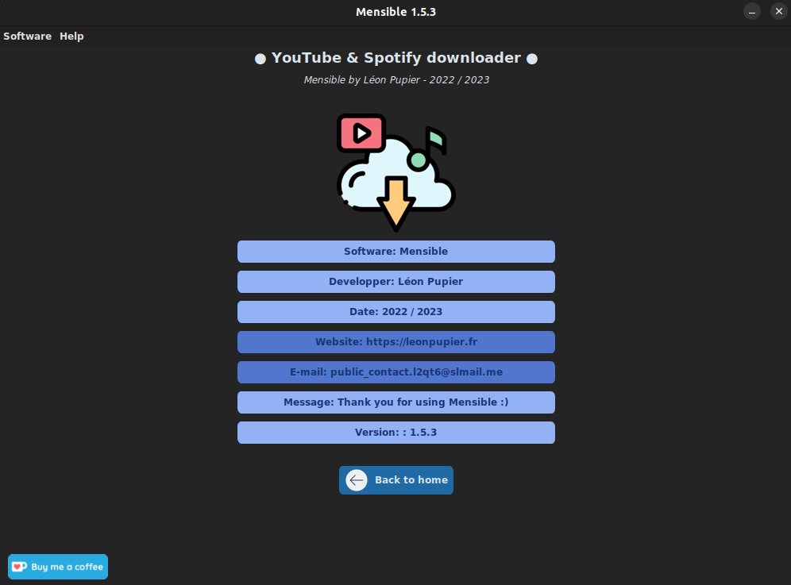

<div align="center">
  <a href="https://github.com/LeonPupier/Mensible">
    
  </a>
  <h3 align="center">Mensible</h3>
  
  A software to download videos and music for free !
  
  <a href="https://www.leonpupier.fr/projects/mensible"><strong>See on the website »</strong></a>
  
  [](https://github.com/LeonPupier/Mensible/releases)
  [](https://github.com/LeonPupier/Mensible/releases)
  
</div>

---

[](https://github.com/LeonPupier/Mensible/)
[](https://github.com/LeonPupier/Mensible/)

### Description

Mensible is a completely free software financed only by donations from generous users
with the goal of providing you with the ability to download videos and music hosted
on YouTube and Spotify for free. You just have to provide the URL of the video and
that's it! The interface is simple and pleasant. You can download the music one by one
or provide the link of a playlist and everything will be downloaded at the same time,
convenient no? Several files can be downloaded at the same time and you can customize
the application with the included settings like the language used.

### Requirements
In order to use the software on your computer, it must meet several requirements:
- **Operating system:**
Linux, Windows (Full compatibility in progess)
- **Processor architecture:**
64 bits recommended
- **Informations:**
Internet access required and administrator rights are optional

### Installation
**1.** To install Mensible on your computer, you need to download the latest [release](https://github.com/LeonPupier/Mensible/releases/latest).

**2.** Before you can launch the software, you must install its dependencies.
Nothing could be simpler, just run this command at the root of the folder:
```
python3 -m pip -r requirements.txt
```
**3.** You can now run the main file of the program with Python:
```
python3 main.py
```
You are now ready to use Mensible!

### Gallery
| _`Home page` state at the opening, base on version 1.5.0_


| _`Settings window` base on version 1.5.0_


| _`Credits window` base on version 1.5.0_



### Roadmap
since v1.5.0:
- [x] Multi-language Support
- [x] Work to revisit the interface to modernize the experience
- [x] Make source code public !

coming soon:
- [ ] Wait for user feedback
- [ ] Features under consideration...

| see the full [changelog](https://github.com/LeonPupier/Mensible/blob/master/Content/changelog.txt) here.

### License
The software license is accessible from the file ```LICENSE```.

Some of the icons used were downloaded from [Flaticon](https://www.flaticon.com/).

### Contact me
[e-mail](mailto:public_contact.l2qt6@slmail.me) - [website](https://leonpupier.fr)
