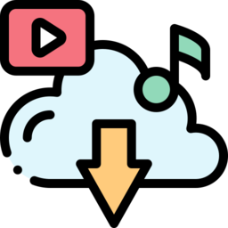
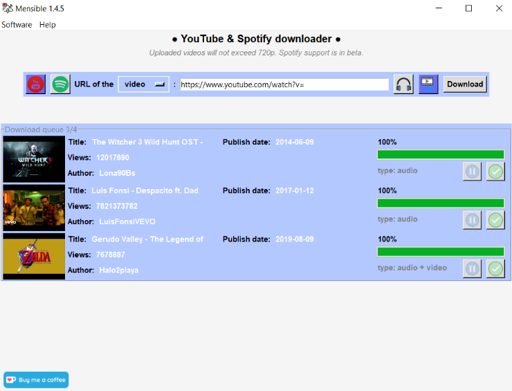
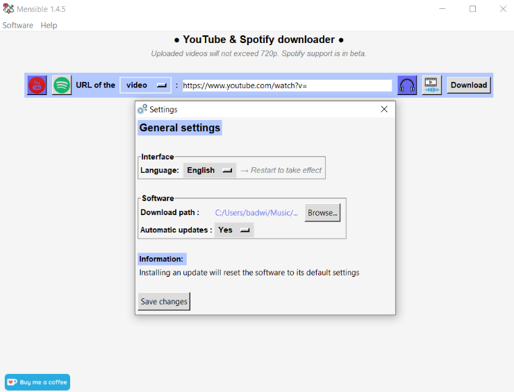

<!-- PROJECT LOGO -->
 

  

  <h3 align="center">♦ Mensible ♦</h3>

  

    A software to download videos and music for free !
     
    <a href="https://www.leonpupier.fr/projects/mensible"><strong>See on the website »</strong></a>
     
     
    <a href="https://github.com/LeonPupier/Mensible/issues">Report Bug or request feature</a>
  

   
   

<!-- PROJECT SHIELDS -->

<!-- TABLE OF CONTENTS -->

  
Table of Contents

  <ol>
    <li><a href="#description">Description</a></li>
    <li><a href="#requirements">Requirements</a></li>
    <li><a href="#installation">Installation</a></li>
    <li><a href="#roadmap">Roadmap</a></li>
    <li><a href="#gallery">Gallery</a></li>
    <li><a href="#credits">Credits</a></li>
    <li><a href="#license">License</a></li>
    <li><a href="#contact">Contact</a></li>
  </ol>

<!-- CONTENTS -->
# Description
***Mensible*** is a completely **free software** financed only by [donations](https://ko-fi.com/leonpupier) from generous users with the goal of providing you with the ability **to download videos and music** hosted on *YouTube* and *Spotify* **for free**.

You just have to provide the URL of the video and that's it! The interface is **simple** and **pleasant**. You can download the music **one by one** or provide the link of a **playlist** and everything will be downloaded at the same time, convenient no?

Several files can be downloaded **at the same time** and you can **customize the application** with the included settings like the **language** used.

# Requirements
In order to use the software on your computer, it must meet several requirements:
- Operating system: *Windows 7/8/10/11*
- Processor architecture: *32/64 bits*
- Internet access required
- **Administrator rights are optional**

# Installation
To install ***Mensible*** on your computer under *Windows* you just have to download the following [installer](https://github.com/LeonPupier/Mensible/releases/latest) 
and follow the instructions of the executable named **Mensible_Setup.exe**.

The executable will install the essential components but at the first start you will have to download the last version of the software for it to work, **otherwise Mensible will not be operational**.

Don't worry, you just have to launch the application and the update will be done automatically without any complex manipulation on your part. After that, you just have to restart the application for the update to take effect and you're done!

*There is no need to restart the computer for the software to install perfectly.*

# Roadmap
- [x] Operational download on the following platforms
  - [x] YouTube
  - [x] Spotify (Beta support)
- [ ] Multi-language Support
    - [x] English
    - [x] Français
    - [x] Deutsch
    - [x] Español
    - [ ] Italiano

# Gallery

  
  
  

# Credits
The software was thought, coded and realized by *Léon Pupier*.

Some of the icons used were downloaded from [Flaticon](https://www.flaticon.com/fr/).

The changes file is available at [this address](https://textup.fr/622032pL).

# License
[See the software license](https://github.com/LeonPupier/Mensible/blob/main/license.txt) on the GitHub repository.

# Contact
**Contact me:**

  <a href="https://twitter.com/Came_Le0n">Twitter</a>
  ●
  <a href="https://www.instagram.com/leon.pupier/">Instagram</a>

**Email:** [leonpupier@gmail.com](mailto:leonpupier@gmail.com)

**Website:** [leonpupier.fr](https://leonpupier.fr)
